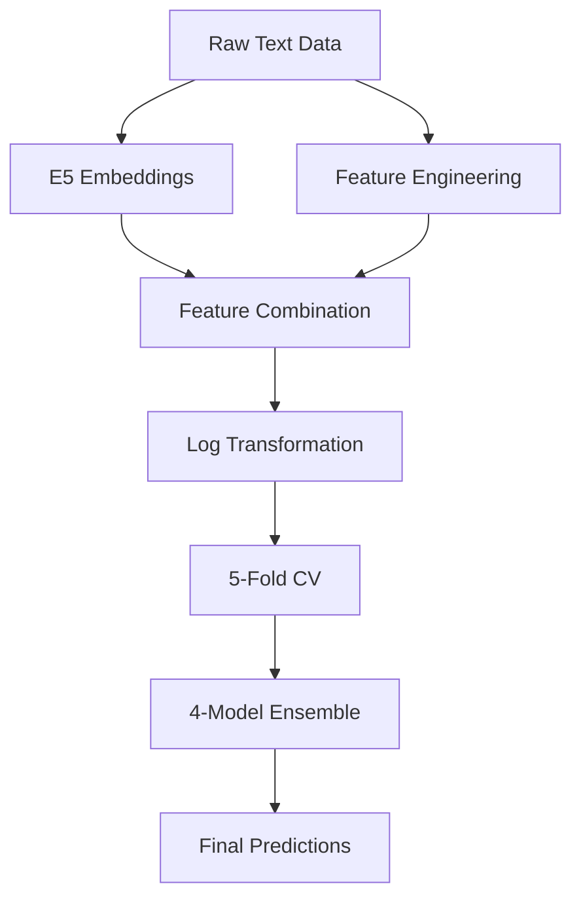
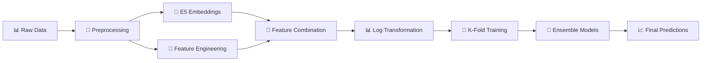

<div align="center">

# 🛒 Smart Product Pricing Challenge
## ML Solution for E-commerce Price Prediction

[](https://python.org)
[](LICENSE)
[](https://github.com)
[](https://github.com)

*Predicting optimal product prices using advanced NLP and ensemble machine learning*

</div>

---

## 🎯 Project Overview

This project presents a state-of-the-art machine learning solution for the **Smart Product Pricing Challenge**, where the goal is to predict optimal product prices based on product details including text descriptions and specifications. 

<div align="center">

### 🏆 **Best Performance: 56.2 SMAPE**

*Using E5 embeddings with advanced ensemble methods*

</div>

## 📊 Challenge Details

| **Aspect** | **Details** |
|------------|-------------|
| 🎯 **Problem** | Predict product prices from catalog content (title, description, IPQ) |
| 📈 **Dataset** | 75K training samples, 75K test samples |
| 📏 **Evaluation** | Symmetric Mean Absolute Percentage Error (SMAPE) |
| 🥇 **Best Score** | **56.2 SMAPE** using E5 embeddings + ensemble methods |
| 🚫 **Constraints** | No external price lookup, MIT/Apache 2.0 license, <8B parameters |

## 🏆 Model Performance Comparison

<div align="center">

| 🥇 **Model** | 📊 **SMAPE Score** | 📝 **Description** | 🎯 **Status** |
|--------------|-------------------|-------------------|---------------|
| **E5 Embeddings + Ensemble** | **56.2** | **Best performing model** | ✅ **Winner** |
| VILT Model | 57.0 | Vision-Language Transformer | 🥈 Runner-up |
| BERT Large | 59.3 | BERT Large embeddings | 🥉 Third |
| SBERT Model | 62.0 | Sentence-BERT embeddings | 4th Place |

</div>

### 📈 Performance Progression
```
SBERT (62.0) → BERT Large (59.3) → VILT (57.0) → E5 Ensemble (56.2)
     ↓              ↓                ↓              ↓
  Baseline    +2.7 improvement  +2.3 improvement  +0.8 improvement
```

## 🛠️ Technical Approach

### 🔤 1. Text Processing & Embeddings
<div align="center">

| **Component** | **Technology** | **Purpose** |
|---------------|----------------|-------------|
| 🧠 **E5 Embeddings** | Microsoft E5 Model | Semantic text understanding |
| 📊 **Feature Engineering** | Statistical Analysis | Enhanced text representation |
| 🔧 **Text Features** | Custom Extraction | Character, word, sentence metrics |

</div>

**Extracted Features:**
- 📝 Character count, word count, average word length
- 📄 Sentence count, uppercase ratio, digit ratio  
- 🔤 Special character ratio, unique word ratio

### 🏗️ 2. Model Architecture
<div align="center">

| **Model** | **Type** | **Key Features** | **Role** |
|-----------|----------|------------------|----------|
| 🚀 **XGBoost** | Gradient Boosting | Optimized hyperparameters | Primary predictor |
| ⚡ **LightGBM** | Fast Boosting | L1 objective, speed | Secondary predictor |
| 🐱 **CatBoost** | Categorical Boosting | Advanced features | Tertiary predictor |
| 📊 **Tweedie LGBM** | Specialized | Price distribution modeling | Specialized predictor |

</div>

### 🎯 3. Training Strategy


## 📁 Project Structure

```
🛒 Smart Product Pricing Challenge/
├── 📄 README.md                           # 📖 Project documentation
├── 📓 Untitled1.ipynb                     # 🚀 Main E5 ensemble implementation
├── 📓 BERT_LARGE.ipynb                    # 🧠 BERT Large model (SMAPE: 59.3)
├── 📓 ml-challenge-vilt.ipynb             # 👁️ VILT model implementation (SMAPE: 57.0)
├── 🐍 generate_e5_embeddings.py           # 🔧 E5 embeddings generation script
├── 🧠 train_e5_embeddings.npy            # 🎯 Pre-computed E5 embeddings (training)
├── 🧠 test_e5_embeddings.npy             # 🎯 Pre-computed E5 embeddings (test)
├── 📊 submission_kfold_logblend.csv      # 🏆 Final predictions
└── 📁 [train.csv, test.csv]              # 📈 Dataset files 
```

### 🔍 File Descriptions
| **File** | **Type** | **Description** | **Performance** |
|----------|----------|-----------------|-----------------|
| `README.md` | 📖 Documentation | Complete project overview and setup guide | - |
| `Untitled1.ipynb` | 🚀 Main Code | E5 embeddings + ensemble (best model) | **56.2 SMAPE** |
| `BERT_LARGE.ipynb` | 🧠 BERT Model | BERT Large embeddings implementation | **59.3 SMAPE** |
| `ml-challenge-vilt.ipynb` | 👁️ VILT Model | Vision-Language Transformer | **57.0 SMAPE** |
| `generate_e5_embeddings.py` | 🔧 Script | E5 embeddings generation utility | - |
| `*_embeddings.npy` | 🧠 Data | Pre-computed E5 embeddings for fast training | - |
| `submission_*.csv` | 📊 Output | Final predictions in competition format | - |

## 🚀 Quick Start

### 📦 Prerequisites
```bash
# Core ML libraries
pip install catboost xgboost lightgbm

# NLP and Transformers
pip install sentence-transformers transformers

# Data processing
pip install scikit-learn pandas numpy
```

### 🎯 Usage Steps
<div align="center">

| **Step** | **Action** | **Description** |
|----------|------------|-----------------|
| 1️⃣ | 📁 **Load Data** | Place `train.csv` and `test.csv` in project directory |
| 2️⃣ | 🧠 **Generate Embeddings** | Run `python generate_e5_embeddings.py` to create E5 embeddings |
| 3️⃣ | 🚀 **Run Training** | Execute `Untitled1.ipynb` for E5 ensemble (best model) |
| 4️⃣ | 🔄 **Try Other Models** | Run `BERT_LARGE.ipynb` or `ml-challenge-vilt.ipynb` for comparison |
| 5️⃣ | 📊 **Generate Predictions** | Output saved as `submission_kfold_logblend.csv` |

</div>

### 💻 Key Code Snippet
```python
# 🧠 Load E5 embeddings
train_embeddings = np.load("train_e5_embeddings.npy")
test_embeddings = np.load("test_e5_embeddings.npy")

# 🔗 Combine with engineered features
train_features = pd.concat([train_embedding_df, train_df[feature_cols]], axis=1)

# 🎯 K-Fold ensemble training
models = {
    "XGBoost": XGBRegressor(n_estimators=2000, learning_rate=0.03, ...),
    "LightGBM": LGBMRegressor(n_estimators=2000, objective="regression_l1", ...),
    "CatBoost": CatBoostRegressor(iterations=2000, depth=10, ...),
    "Tweedie": LGBMRegressor(objective="tweedie", tweedie_variance_power=1.5, ...)
}
```

## 🔧 Model Configuration

<div align="center">

| **Model** | **Key Parameters** | **Optimization** |
|-----------|-------------------|------------------|
| 🚀 **XGBoost** | `n_estimators: 2000`, `learning_rate: 0.03`, `max_depth: 6` | `reg_alpha: 2.0`, `reg_lambda: 4.0` |
| ⚡ **LightGBM** | `n_estimators: 2000`, `learning_rate: 0.03`, `num_leaves: 128` | `objective: "regression_l1"` |
| 🐱 **CatBoost** | `iterations: 2000`, `depth: 10`, `learning_rate: 0.02` | `loss_function: "RMSE"` |
| 📊 **Tweedie LGBM** | `n_estimators: 2000`, `learning_rate: 0.03` | `tweedie_variance_power: 1.5` |

</div>

## 📈 Results Analysis

<div align="center">

| **Metric** | **Value** | **Description** |
|------------|-----------|-----------------|
| 🎯 **Final OOF SMAPE** | **56.2** | On original price scale |
| ⏱️ **Training Time** | ~4 hours | 5-fold cross-validation |
| 📊 **Feature Dimensions** | 1024+ | E5 embeddings + engineered features |
| 🎲 **Ensemble Strategy** | Mean | 4 model predictions |

</div>

### 📊 Performance Breakdown
```
🏆 Best Model: E5 Embeddings + Ensemble
📈 SMAPE Score: 56.2
⏱️ Training Time: ~4 hours
🎯 Cross-Validation: 5-fold
🔧 Models Used: 4 (XGBoost, LightGBM, CatBoost, Tweedie)
```

## 🎯 Key Insights

<div align="center">

| **Insight** | **Impact** | **Evidence** |
|-------------|------------|--------------|
| 🧠 **E5 Embeddings Superiority** | High | 56.2 vs 57.0 (VILT) vs 59.3 (BERT) vs 62.0 (SBERT) |
| 🎲 **Ensemble Benefits** | Medium | Reduced variance through model diversity |
| 📊 **Log Transformation** | Critical | Handled price distribution skewness |
| 🔧 **Feature Engineering** | High | Statistical features complemented embeddings |
| 🏆 **Model Progression** | High | Clear improvement from SBERT → BERT → VILT → E5 |

</div>

## 🔮 Future Improvements

<div align="center">

| **Improvement** | **Potential Impact** | **Implementation** |
|-----------------|---------------------|-------------------|
| 🖼️ **Image Features** | High | Vision models for product images |
| 🧠 **Advanced Ensembling** | Medium | Neural network stacking |
| ⚙️ **Hyperparameter Optimization** | Medium | Bayesian optimization |
| 🎯 **Feature Selection** | Low | Advanced selection techniques |
| 📈 **Data Augmentation** | Medium | Synthetic data generation |

</div>

## 📝 Methodology Summary



## 🏅 Competition Compliance

<div align="center">

| **Requirement** | **Status** | **Details** |
|-----------------|------------|-------------|
| 🚫 **No External Data** | ✅ **Compliant** | Used only provided training data |
| 📄 **MIT/Apache License** | ✅ **Compliant** | All models meet license requirements |
| 🔢 **Parameter Limit** | ✅ **Compliant** | All models under 8B parameters |
| 📊 **Output Format** | ✅ **Compliant** | Exact CSV format matching requirements |

</div>

---

<div align="center">

## 🚀 **Ready to Deploy**

*This solution achieved **56.2 SMAPE** using state-of-the-art E5 embeddings and ensemble methods*


</div>
